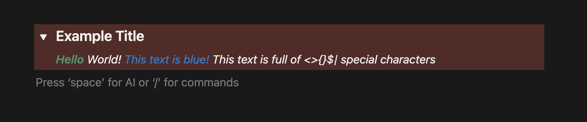

# @michael-masarik/notion-md

**UNDER CONSTRUCTION!!**

>A simple package to create enhanced markdown objects compatible with the Notion API

`notion-md` allows you to construct type-safe, fully escaped [Notion Enhanced Markdown](https://developers.notion.com/guides/data-apis/enhanced-markdown). 

example:
```js
import {toggle, bold, itallic, color} from @michael-masarik/notion-md

const toggleContent = `${bold({text: "Hello", color: "green"})} World! ${color("This text is blue!", "blue")} And this text is full of <>{}$| special character`;

const newToggle = toggle({
    title: "Example Title",
    headingLevel: 3
    color: "red_bg"
    children: toggleContent
});

console.log(newToggle);

// ### Example Title {toggle="true" color="red_bg"}
//  **Hello{color="green"}** World! <span color="blue">This text is blue!</span> This text is full of \<\>\{\}\$\| special characters
```
**Output**


The output from all functions in this module is a standard string, no special encodings or objects. the `escape()` function validates your input and escapes and Notion-specific special characters. Any time an external link is used, it too is vaildated by the js `URL` class

There are shortcuts for headings:
```js
import heading from @michael-masarik/notion-md

const heading1 = heading({
    text: "A 1st heading",
    level: 1
})
// # A 1st heading

const heading2 = heading({
    text: "A 2nd heading",
    level: 2
})
// ## A 2nd heading

const heading3 = heading({
    text: "A 3rd heading",
    level: 3
})
// ### A 3rd heading

const redHeading = heading({
    text: "A 2nd heading which is red",
    level: 2,
    color: "red"
})
// ## A 2nd heading which is red{color="red"}

```

The `toggle()` function automatically detects toggle headings and switches between the `# {toggle="true"}` and `<details>...</details>` syntax

Supported blocks can be found in [supported.md](supported.md)